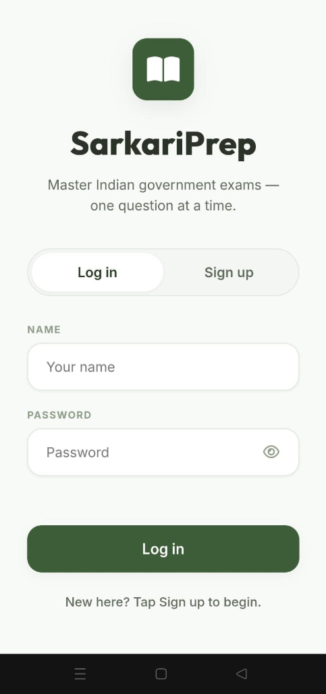
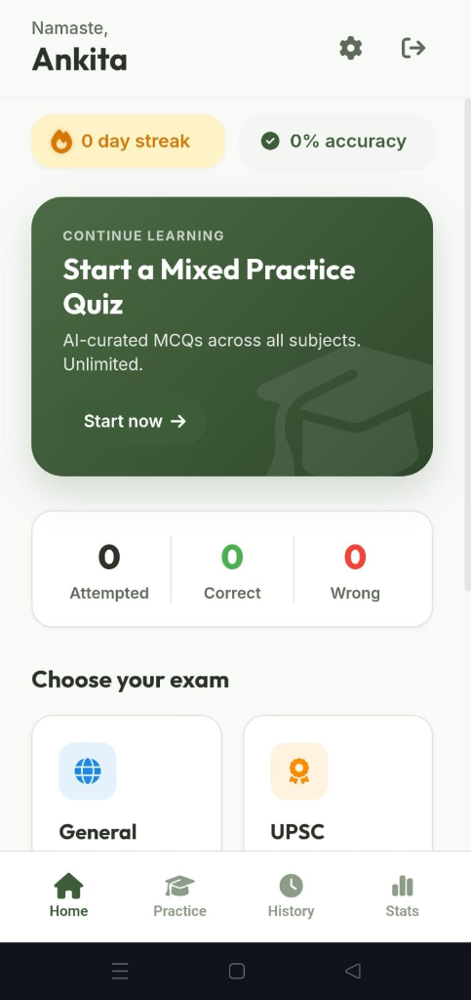
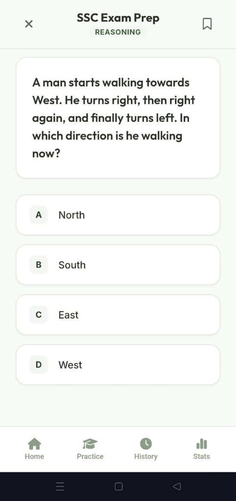
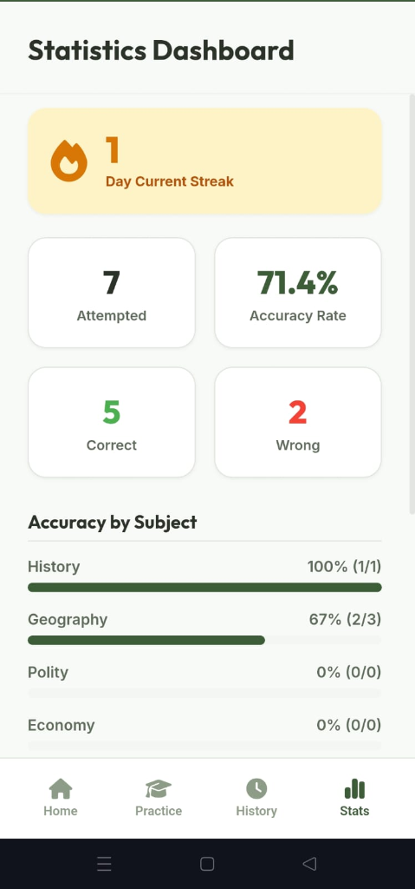

# 🚀 SarkariPrep - AI-Assisted Current Affairs Quiz Platform

[](LICENSE)
[](https://sarkariprep-app.vercel.app)

👉 **[Click Here to Launch the Live Web App](https://sarkariprep-app.vercel.app)**  


---

> A mobile-first Progressive Web App (PWA) designed to help students prepare for Indian competitive exams (UPSC, SSC, Banking, Railways, State PSC) through daily interactive quizzes and AI-assisted question generation.

---

<!-- 📸 APP BANNER -->


---

## 💡 Why I Built This

I built this project after a friend preparing for Indian government exams (UPSC, SSC, Banking, Railways, State PSC, etc.) described how difficult it was to stay updated with current affairs and regularly test themselves.

Current affairs change every day, and while there are plenty of news sources, converting those updates into exam-style practice questions takes time. I wanted to explore whether AI-assisted question generation could make daily practice easier while providing a simple quiz experience that tracks progress over time.

This project started as an experiment to learn by building. I had only basic Flask knowledge and used AI development tools to rapidly prototype the application, iterating on it through testing, debugging, and feedback from actual users preparing for competitive exams.

---

## 🎯 About the Project

**SarkariPrep** is a Progressive Web App (PWA) that generates and serves government exam practice questions across multiple categories.

### Key Features:
* 📚 **Multiple Exam Categories**: Practice MCQs customized for UPSC, SSC, Banking, Railways, State PSC, and General Knowledge.
* 🤖 **AI-Assisted Question Generation**: Dynamic question synthesis using Gemini 2.5 Flash API for fresh, relevant questions.
* 👤 **User Authentication**: Secure user login and account management.
* 🔥 **Daily Streak Tracking**: Encourages consistent daily practice habits.
* 📈 **Accuracy Statistics**: Real-time stats and category-wise performance breakdown.
* 📝 **Question History & Review**: Detailed review of attempted questions with complete answer explanations.
* ⭐ **Bookmarking**: Save challenging questions for later revision.
* 📱 **PWA & Mobile Installable**: Installable directly on mobile home screens via browser "Add to Home Screen".
* ☁️ **Cloud Deployment**: Deployed on Vercel with automated continuous deployment.

The goal wasn't just to generate questions—it was to create an experience where users could return every day, continue where they left off, and monitor their learning progress.

---

## 🖼️ Application Preview

| 📱 Authentication | 🏠 Home Dashboard |
| :---: | :---: |
|  |  |

| ✍️ Practice Quiz Interface | 📊 Detailed Analytics & Stats |
| :---: | :---: |
|  |  |


---

## 🌱 Development Journey

This wasn't built in one sitting. As friends started using the application, I continuously improved it based on their feedback.

Some of the key iterations included:
- 🐛 Fixing question loading issues & edge cases
- 🎨 Improving question formatting and readable layout
- 📦 Generating larger, high-quality question datasets
- 🎯 Refining AI prompts for accurate, preface-free exam questions
- ⚖️ Balancing question difficulty across different exam levels
- 🏷️ Adding additional exam categories (Reasoning, Geography, 2025/2026 Current Affairs)
- 💅 Enhancing UI/UX with smooth feedback micro-animations
- 📊 Tracking user stats and streak logic
- 🛠️ Fixing bugs reported during real-user testing

### ⚠️ Overcoming API Limitations
One interesting challenge was API rate limitations. As question generation relied on external AI APIs, exhausted quotas sometimes resulted in repetitive or topic-heavy questions. Working through these constraints taught me a lot about caching strategies, fallback question banks, and the practical challenges of building AI-powered applications.

---

## 🔒 Why This Repository Was Private Initially

I originally kept this repository private because I didn't feel it was "good enough."

As I learned more, fixed bugs, improved the architecture, and received feedback from real users, I realized that imperfect projects still have value if they demonstrate genuine learning and iterative development.

Rather than showcasing a polished tutorial project, I'd rather share the actual journey of building, breaking, fixing, testing, and continuously improving a real application.

---

## 🛠️ Tech Stack & Architecture

* **Backend**: Python / Flask
* **Frontend**: HTML5, Vanilla CSS3 (Custom Glassmorphism theme), JavaScript (ES6+)
* **Database**: SQLite (Local Dev) / PostgreSQL (Vercel Production)
* **AI Model**: Google Gemini 2.5 Flash API
* **PWA**: Service Worker (`sw.js`) with Network-First offline support
* **Deployment**: Vercel Serverless Functions

---

## 📄 License

This project is open-source and available under the [MIT License](LICENSE).

---

## 💻 Local Setup & Development

1. **Clone the Repository**:
   ```bash
   git clone https://github.com/Ankita-k002/study-helper.git
   cd study-helper
   ```

2. **Install Dependencies**:
   ```bash
   pip install -r requirements.txt
   ```

3. **Initialize & Seed Database**:
   ```bash
   python seed_questions.py
   ```

4. **Run the Application**:
   ```bash
   python app.py
   ```
   Open `https://127.0.0.1:5000` in your browser.
