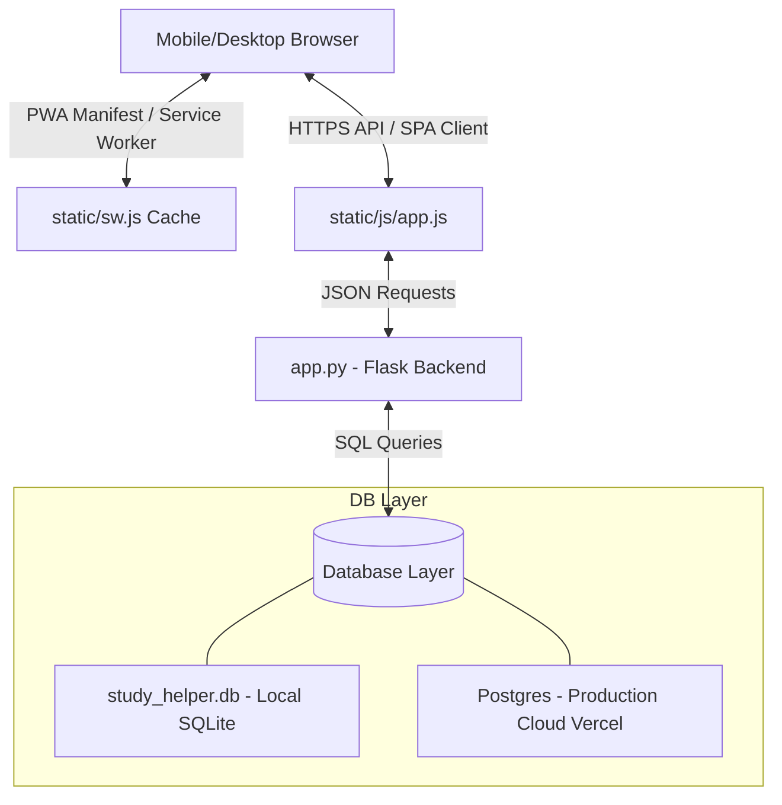

# System Architecture

This document describes the high-level system architecture and database design of SarkariPrep.

For interface definitions, see [[API Documentation]].

---

## 📊 Component Diagram

---

## 📁 Codebase Layout

* **[[app.py]]**: Standard Flask backend routing. Binds session authentication, quiz serving logic, answer validations, and bookmarking. Bypasses SSL with adhoc context for local PWA setup.
* **[[database.py]]**: Connection manager layer supporting SQLite for offline local dev and PostgreSQL for production deployments.
* **[[seed_questions.py]]**: Generates database tables and inserts mock questions.
* **[[generate_1000_questions.py]]**: Automated ingestion tool querying Gemini 2.5 Flash for Current Affairs questions.

---

## 💾 Database Schema

The database supports hybrid structures (SQLite/PostgreSQL mappings). Below are the documented table schemas:

### Table: `users`

| Column | Type / Constraints |
| --- | --- |
| `id` | `SERIAL PRIMARY KEY` |
| `name` | `VARCHAR(255) UNIQUE NOT NULL` |
| `password` | `VARCHAR(255) NOT NULL` |
| `streak` | `INTEGER DEFAULT 0` |
| `last_active` | `VARCHAR(255)` |
| `created_at` | `TIMESTAMP DEFAULT CURRENT_TIMESTAMP` |

### Table: `questions`

| Column | Type / Constraints |
| --- | --- |
| `id` | `SERIAL PRIMARY KEY` |
| `category` | `VARCHAR(255) NOT NULL` |
| `subject` | `VARCHAR(255) NOT NULL` |
| `question_text` | `TEXT NOT NULL` |
| `option_a` | `TEXT NOT NULL` |
| `option_b` | `TEXT NOT NULL` |
| `option_c` | `TEXT NOT NULL` |
| `option_d` | `TEXT NOT NULL` |
| `correct_option` | `VARCHAR(10) NOT NULL` |
| `explanation` | `TEXT NOT NULL` |
| `is_ai_generated` | `INTEGER DEFAULT 0` |
| `created_at` | `TIMESTAMP DEFAULT CURRENT_TIMESTAMP` |

### Table: `user_attempts`

| Column | Type / Constraints |
| --- | --- |
| `id` | `SERIAL PRIMARY KEY` |
| `user_id` | `INTEGER NOT NULL` |
| `question_id` | `INTEGER NOT NULL` |
| `selected_option` | `VARCHAR(10) NOT NULL` |
| `is_correct` | `INTEGER NOT NULL` |
| `attempted_at` | `TIMESTAMP DEFAULT CURRENT_TIMESTAMP` |

### Table: `bookmarks`

| Column | Type / Constraints |
| --- | --- |
| `id` | `SERIAL PRIMARY KEY` |
| `user_id` | `INTEGER NOT NULL` |
| `question_id` | `INTEGER NOT NULL` |
| `created_at` | `TIMESTAMP DEFAULT CURRENT_TIMESTAMP` |

### Table: `user_settings`

| Column | Type / Constraints |
| --- | --- |
| `user_id` | `INTEGER PRIMARY KEY` |
| `gemini_api_key` | `TEXT` |
| `use_ai_generation` | `INTEGER DEFAULT 0` |

---

## 🔗 Related Documents
* [[Project Overview]]
* [[API Documentation]]
* [[Change Logs]]

Generated at: 2026-06-21 17:15:45
